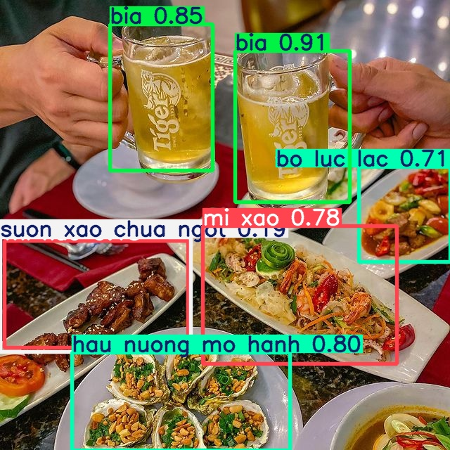

# Nhậu môn EmT - Custom YOLOv5 Object Detection

A practical project for training a YOLOv5 model to detect objects in the "Nhậu môn EmT" dataset. The workflow includes dataset preparation, model training, evaluation, and inference.

---

## Key Steps

- **Assemble & Annotate Dataset:** Use Roboflow to label and export data in YOLOv5 format.
- **Train Model:** Fine-tune YOLOv5 on the custom dataset.
- **Evaluate:** Monitor performance with TensorBoard and focus on mean Average Precision (mAP).
- **Inference:** Test the trained model on new images.

---

## Tech Stack

- **Languages & Frameworks:** Python, PyTorch, YOLOv5
- **Tools:** Roboflow, TensorBoard, OpenCV, NumPy, Jupyter Notebook

---

## Project Structure

```
├── data.yaml                # Dataset configuration
├── Emer_Test02.ipynb        # Main notebook
├── train/                   # Training images & labels
├── valid/                   # Validation images & labels
├── test/                    # Test images & labels
```

---

## Results

- Detects custom objects in new images.
- Evaluated using mean Average Precision (mAP).

## Sample Result


---

## References

- [YOLOv5 by Ultralytics](https://github.com/ultralytics/yolov5)
- [Roboflow Documentation](https://docs.roboflow.com/)
- [Mean Average Precision (mAP)](https://blog.roboflow.com/mean-average-precision/)

---
